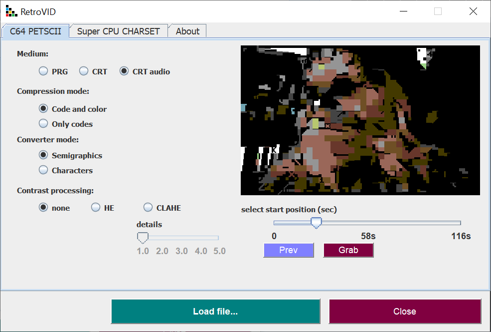
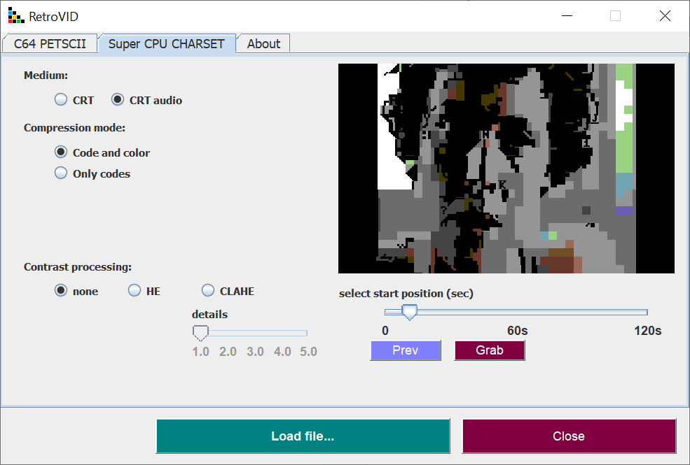

# Simple Video Converter for retro machines

Now you can make a short clip for your retro computer. Just open your favorite movie, select scene (slider, preview button) and grab it (grab button). Thats all.

C64 PETSCII and CHARSET Super CPU supported.

Installation: 

* install JRE16 or newer
* install video library for JAVA [javacv](https://sourceforge.net/projects/javacv.mirror/)
* create libs directory
* copy JAVACV *jar files to libs directory next to retrovid.jar 
* copy all EXT files to libs directory

Java users can run java builder with <b>mvn clean package</b> command. Maven builder is required to do that. Running from console can give you some hints and additional info about errors, missing libs, movie parameters etc.

Just type <b>java -jar retropic.jar</b> and do not close console window.

CRT directory contains cartridge examples

Medium

- PRG - C64 program, simply type RUN command in BASIC
- CRT - Game System C64 cartridge capable of holding 512 kB, clips can be 2 minuts long
- CRT audio - Game System C64 cartridge with 4,4 kHz digitized sound. Playback can by jazzy, fast scenes requires more CPU power.
 
Compression mode

- Code and color - all changes are recorded, screen codes and colors
- Codes - only changed screen codes and theirs colors are recorded

Converter mode

- Semigraphics - prefers semigraphics
- Characters - prefers characters

Contrast processing

- none - no postprocessing at all
- HE - color histogram equalizer (global)
- CLAHE - clipped adaptive color histogram equalizer (local) with sharpen level 

New method with neural net learns new charset definition. Movie key frames are divided into 8x8 blocks which feads net. Smoother pictures but takes some time. You can try to run cartridges on C64, some movies, with slow action will work nicely. 

Medium

- CRT - Game System C64 cartridge capable of holding 512 kB, clips can be 2 minuts long
- CRT audio - Game System C64 cartridge with 4,4 kHz digitized sound with simply low band filter 2,2 kHz cutoff
 
Compression mode

- Code and color - all changes are recorded, screen codes and colors
- Codes - only changed screen codes and theirs colors are recorded

Contrast processing

- none - no postprocessing at all
- HE - color histogram equalizer (global)
- CLAHE - clipped adaptive color histogram equalizer (local) with sharpen level 

