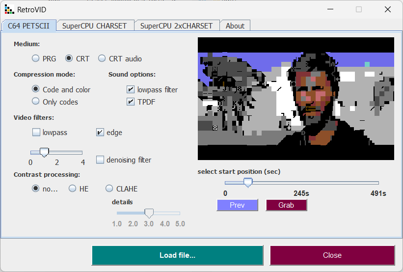
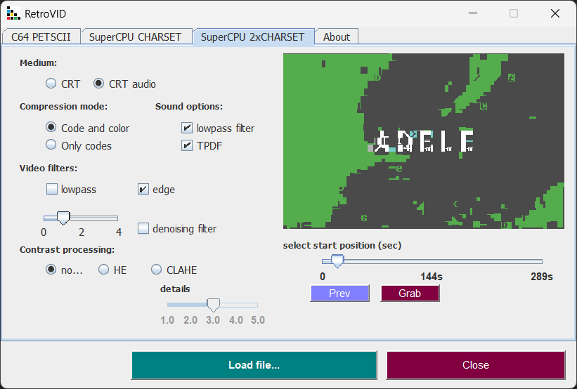

# Simple Video Converter for retro machines

Now, you can create a short clip for your retro computer. Just open your favourite movie, select a scene (slider or preview button) and grab it (grab button). That's all.

Videos with 24 frames per second are recommended. C64 timings are very tight; any other frame rates will cause sound desynchronisation.

## Versions

* 1.5 - Audio completely reworked, compressor, normalizer with dithering produces decent sound
* 1.4 - New mode with 2 regenerated charsets, new edge filter, reworked sound grabbing
* 1.3 - Reworked ML media player, better and faster neural matcher, added neural denoiser, downsample with dithering (TPDF).
* 1.2 - NN reworked - slow but produces better output.
* 1.1 - Improved palette & color handling.
* 1.0 - All charset characters are made by neural net, minor changes.
* 0.1 - C64 PETSCII and CHARSET Super CPU supported.

## Installation: 

* install JRE16 or newer
* install video library for JAVA [javacv](https://sourceforge.net/projects/javacv.mirror/)
* download libs directory and put JAVACV library there, without JAVACV CONVERTER WON'T WORK !!!

Java users can run java builder with <b>mvn clean package</b> command. Maven builder is required to do that. Running from console can give you some hints and additional info about errors, missing libs, movie parameters etc.
Just type <b>java -jar retropic.jar</b> and do not close console window.

CRT directory contains cartridge examples, 512kb clips

## C64

Medium

- PRG - C64 program, simply type RUN command in BASIC
- CRT - Game System C64 cartridge capable of holding 512 kB, clips can be 2 minutes long
- CRT audio - Game System C64 cartridge with 5,512 kHz digitized sound. Playback can be jazzy, fast scenes require more CPU power.
 
Compression mode

- Code and color - all changes are recorded, screen codes and colors
- Codes - only changed screen codes and theirs colors are recorded

Sound options

- lowpass filter - simple filter with 5,512 kHz cutoff
- TPDF - triangle probability function used by dithering sound downsampling, unchecked means rectangle function.

compressor and normalizer is always on

Video filters

- lowpass - low pass filter reduces details, you set how much details you want to remove
- edge - edge detection filter, increase details, more details shorter movie
- denoising filter - simple autoencoder noise filter - reconstructs characters from 8x8 bitmap (experimental)

Contrast processing

- none - no postprocessing at all
- HE - color histogram equalizer (global)
- CLAHE - clipped adaptive color histogram equalizer (local) with sharpen level 

## Super CPU - redefined charset

New method with neural net learns new charset definitions. Movie key frames are divided into 8x8 blocks which feeds net. Smoother pictures but takes some time. You can try to run cartridges on C64. Some movies, with slow action will work nicely. 

Medium

- CRT - Game System C64 cartridge capable of holding 512 kB, clips can be 2 minutes long
- CRT audio - Game System C64 cartridge with 5,512 kHz digitized sound with simple low band filter cutoff
 
same conversion options.

## Super CPU - 2 redefined charset simultaneously

Extra charset added. Same algorithm as Super CPU Movie with key frames are divided into 8x8 blocks which feeds net. Extra smoothness costs shorter video.

same conversion options.
